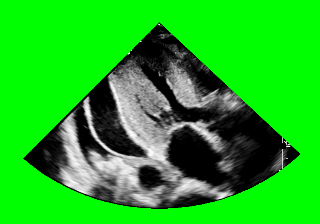

# Pericardial-Effusion-experimental-data

The `data/` directory structured as follows:

```
data
├── 1
| ├── fold1_process_img
| | ├──{file_a}.png
| | .........
| └── fold1_mask
|   ├──{file_a}.png
|   .........
├── 2
...
└── 10
```

folder 1 to folder 10 store corresponding fold data,
fold data were separate into images and masks folder,




